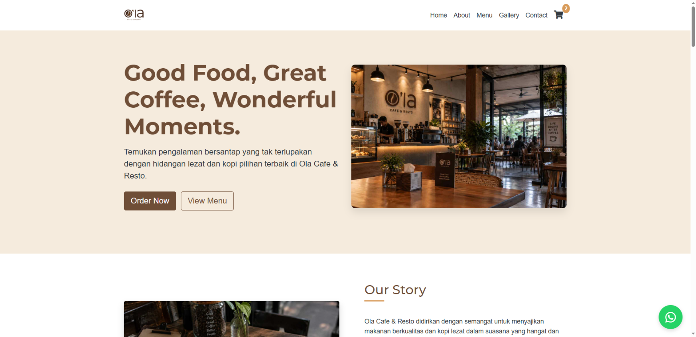
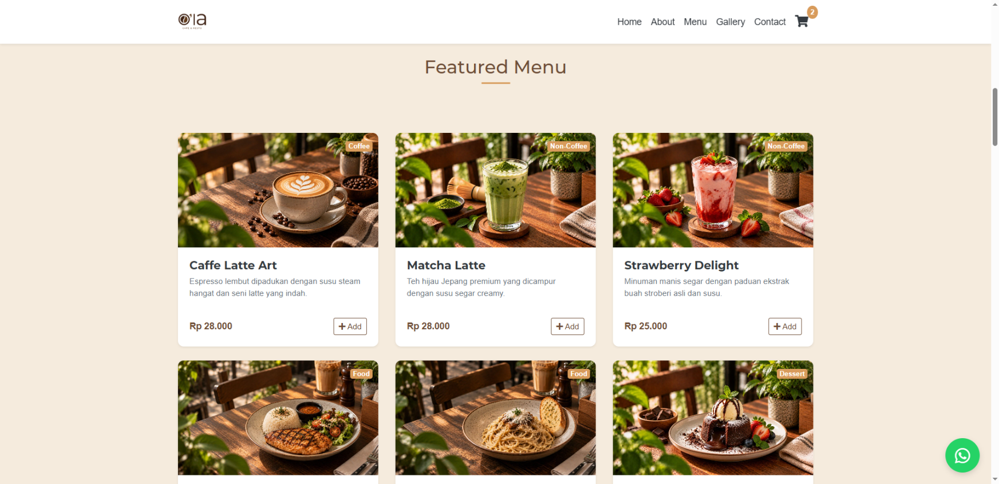
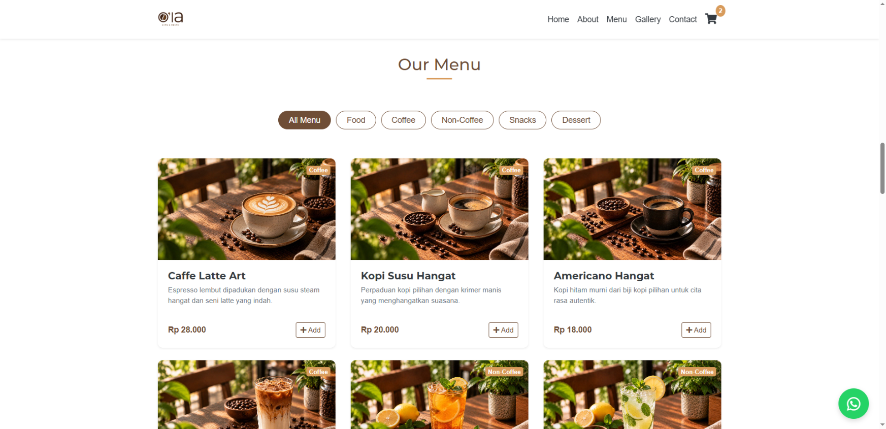
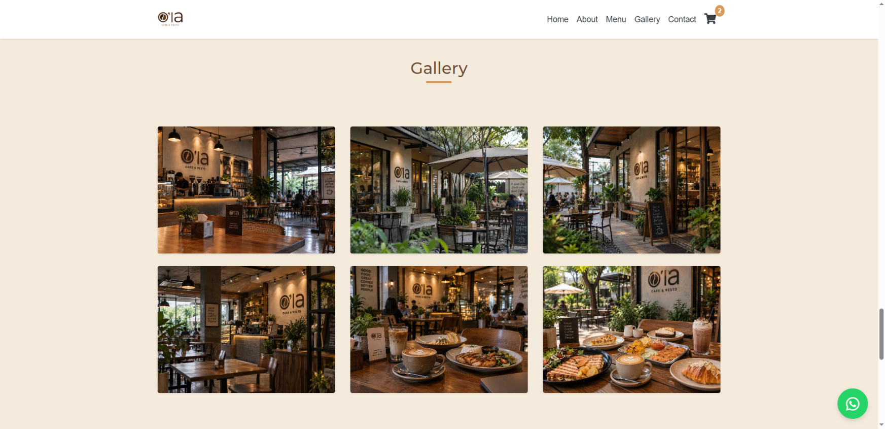
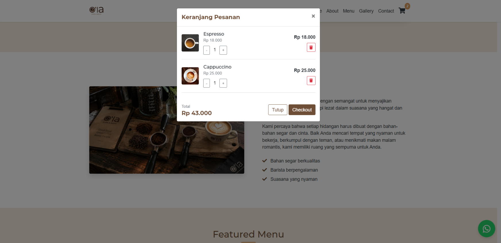
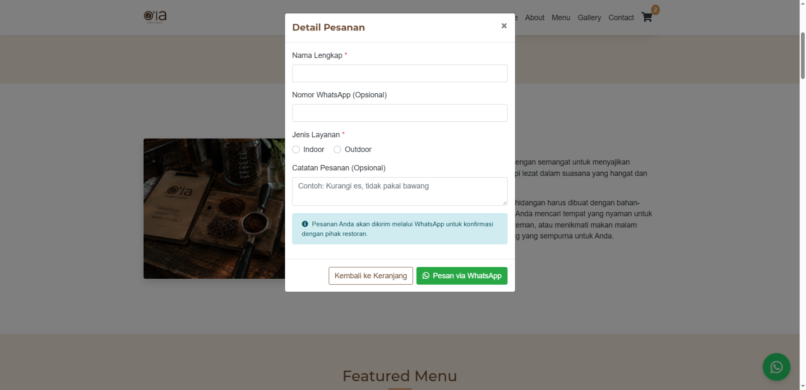

# ☕ Ola Cafe & Resto

**Web-Based Contactless Ordering System with WhatsApp API Integration**

## 📖 Background & Challenge

During the 2021 social restrictions, one of my clients in the F&B industry faced a major challenge: finding an efficient way to accept customer orders without violating health protocols. At the same time, relying on third-party delivery platforms significantly cut into their already thin profit margins.

## 💡 The Solution

To solve this, I built **Ola Cafe & Resto** a lightweight, fast, and highly functional web application tailored to meet their immediate business needs.

Instead of developing a complex and costly backend system, I focused on cost efficiency and ease of operational adoption. I designed a **local shopping cart system** using pure Vanilla JavaScript that integrated directly with the **WhatsApp API**. Customers could seamlessly browse the menu, add items to their cart, and checkout directly to the shop’s WhatsApp number without any physical contact.

## 🚀 Key Technologies & Features

- **Responsive UI:** Built with HTML5, CSS3, and Bootstrap 4.6 to ensure a seamless and clean user experience across all smartphone screen sizes.
- **DOM Manipulation:** Features a dynamic menu category filter powered by pure Vanilla JS for instant page load performance.
- **WhatsApp Checkout:** A localized shopping cart system that automatically formats the order receipt into a structured text message, making it easy for the cafe's admin to process.
- **Interactive Gallery & PWA:** Integrated GLightbox and Web Manifest, allowing the web app to be installed on the customer's home screen like a native application without consuming device storage.

## 🌐 Live Demo

Check out the live version of the project here:
👉 **[Live Demo](https://ola-cafe-web-app.vercel.app/)**

## 🎯 Conclusion

Managing this project reinforced my belief that a Software Engineer’s expertise is not just measured by the complexity of the frameworks they use, but by their ability to deliver cost-effective, practical solutions that directly impact a client's business continuity.

> *For fellow developers and business owners, how did you navigate the challenges of digitalizing local businesses during those unprecedented times? Let’s connect and discuss!*

---

## 📸 Screenshots

*(Below are placeholder examples, replace them with actual screenshots of your Landing Page, Menu Filter, and Cart Checkout)*

  
  
  
  
  
  

